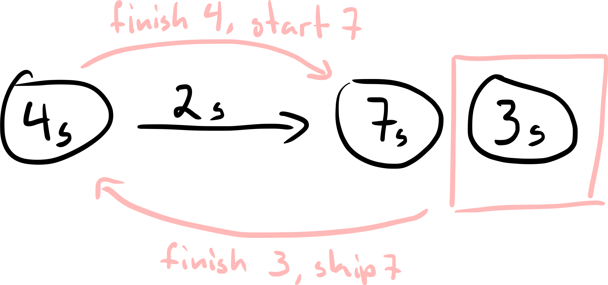
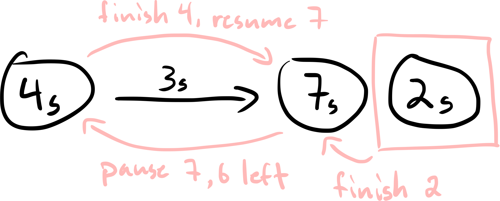
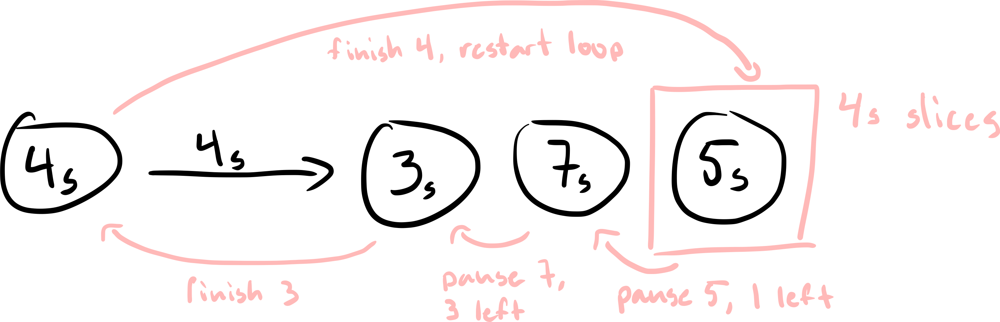

## HW 1

#### Question 1

What is the output of the following program? List ALL the
possible output(s)

1. Parent process runs first:

    ```start num is 99
    Parent's num is 110
    end num is 109
    Child's num is 130
    end num is 129
    ```

2. Child process runs first

    ```start num is 99
    Child's num is 130
    end num is 129
    Parent's num is 110
    end num is 109
    ```

3. Parent prints first then Child

    ```start num is 99
    Parent's num is 110
    Child's num is 130
    end num is 109
    end num is 129
    ```

4. Child prints first then Parent
    ```start num is 99
    Child's num is 130
    Parent's num is 110
    end num is 129
    end num is 109
    ```

#### Question 2

Which of the following scheduling algorithms could result in starvation? For those algorithms that might result in starvation, describe a situation in which starvation is likely to occur? (2 points)

1. First-come, first-served (FCFS)  
   FCFS does not typically result in starvation because each process will eventually get its turn to execute.

2. Shortest Job First (SJF)  
   SJF can result in starvation if there is a continuous stream of short jobs. In this case, longer jobs may never get scheduled because there are always shorter jobs arriving.

3. Round Robin  
   Round Robin does not typically result in starvation because each process gets an equal share of the CPU time in a cyclic order.

4. Basic MLFQ with first 4 rules  
   Basic MLFQ can result in starvation if a process is demoted to a lower-priority queue and there are always higher-priority processes available to run. The lower-priority process may never get CPU time.

**Job, Length, Arrival Time**  
J1, 85s, 0  
J2, 30, 10  
J3, 35, 10  
J4, 20, 80  
J5, 50, 85  
Time slice = 10s

**FIFO**

J1: completion 85, turnaround 85, response 0  
J2: completion 115, turnaround 115 - 10 = 105, response 85  
J3: completion 150, turnaround 150 - 10 = 140, response 115  
J4: completion 170, turnaround 170 - 80 = 90, response 150  
J5: completion 220, turnaround 220 - 85 = 135, response 170

**Average Turnaround Time:** (85 + 105 + 140 + 90 + 135) / 5 = 111  
**Average Response Time:** (0 + 85 + 115 + 150 + 170) / 5 = 104

**RR**

-   Round 1:
    -   J1 0-10, 75
-   Round 2:
    -   J1 10-20, 65
    -   J2 20-30, 20
    -   J3 30-40, 25
-   Round 3:
    -   J1 40-50, 65
    -   J2 50-60, 10
    -   J3 60-70, 15
-   Round 4:
    -   J1 70-80, 55
    -   J2 80-90, 0, completion 90
    -   J3 90-100, 5
    -   J4 100-110, 10
    -   J5 110-120, 40
-   Round 5:
    -   J1 120-130, 45
    -   J3 130-135, 0, completion 135
    -   J4 135-145, 0, completion 145
    -   J5 145-155, 30
-   Round 6:
    -   J1 155-165, 35
    -   J5 165-175, 20
-   Round 7:
    -   J1 175-185, 25
    -   J5 185-195, 10
-   Round 8:
    -   J1 205-215, 15
    -   J5 215-225, 0, completion 225
-   Round 9:
    -   J1 225-235, 5
-   Round 10:
    -   J1 235-240, 0, completion 240

J1: completion 240, turnaround 240 - 0 = 240, response 0  
J2: completion 90, turnaround 90 - 10 = 80, response 10  
J3: completion 135, turnaround 135 - 10 = 125, response 20  
J4: completion 145, turnaround 145 - 80 = 65, response 20  
J5: completion 225, turnaround 225 - 85 = 140, response 25

**Average Turnaround Time:** (240 + 80 + 125 + 65 + 140) / 5 = 130  
**Average Response Time:** (0 + 10 + 20 + 20 + 25) / 5 = 15

**STCF**

-   J1 0-10, (remaining 75)
-   J2 arrives at 10, J3 arrives at 10
-   J2 10-40 (remaining 0, completion 40)
-   J3 40-75 (remaining 0, completion 75)
-   J1 75-80 (remaining 70)
-   J4 arrives at 80
-   J4 80-100 (remaining 0, completion 100)
-   J5 arrives at 85
-   J5 100-150 (remaining 0, completion 150)
-   J1 150-225 (remaining 0, completion 225)

J1: completion 225, turnaround 225 - 0 = 225, response 0  
J2: completion 40, turnaround 40 - 10 = 30, response 10  
J3: completion 75, turnaround 75 - 10 = 65, response 40  
J4: completion 100, turnaround 100 - 80 = 20, response 80  
J5: completion 150, turnaround 150 - 85 = 65, response 100

**Average Turnaround Time:** (225 + 30 + 65 + 20 + 65) / 5 = 81  
**Average Response Time:** (0 + 10 + 40 + 80 + 100) / 5 = 46

#### Question 3

**Process, Length, Arrival Time**  
P1, 16, 0  
P2, 7, 2  
P3, 2, 4  
P4, 4, 6  
P5, 22, 8

1. ```
    P1: completion 16, turnaround 16
    P2: completion 23, turnaround 21
    P3: completion 25, turnaround 21
    P4: completion 29, turnaround 23
    P5: completion 51, turnaround 43

    Average turnaround = (16 + 21 + 21 + 23 + 43) / 5 = 24.8
   ```

2. ```
    P1: completion 16, turnaround 16
    P3: completion 18, turnaround 14
    P2: completion 25, turnaround 23
    P4: completion 29, turnaround 23
    P5: completion 51, turnaround 43

    Average turnaround = (16 + 14 + 23 + 23 + 43) / 5 = 23.8
   ```

3. ```
    P1: completion 29, turnaround 29
    P2: completion 9, turnaround 7
    P3: completion 11, turnaround 7
    P4: completion 15, turnaround 9
    P5: completion 51, turnaround 43

    Average turnaround = (29 + 7 + 7 + 9 + 43) / 5 = 19
   ```

4. ```
    P1: completion 44, turnaround 44
    P2: completion 28, turnaround 26
    P3: completion 12, turnaround 8
    P4: completion 16, turnaround 10
    P5: completion 51, turnaround 43

    Average turnaround = (44 + 26 + 8 + 10 + 43) / 5 = 26.2
   ```

**FIFO**  


**SJF**  


**STCF**  


**RR**  


#### Question 4

```

int* add(const int* a, const int* b) {
    if (a == NULL || b == NULL)
        return NULL;
    int *ret = malloc(sizeof(int));
    if (ret == NULL)
        return NULL;
    *ret = *a + *b;
    return ret;
}

int main(int argc, char** argv) {
    int a = 3;
    int b = 4;
    int *ret = add(&a, &b);
    if (ret == NULL)
        printf("Error\n");
    else {
        printf("3+4=%d\n", *ret);
        free(ret); // Free the allocated memory
    }
    return 0;
}

```
